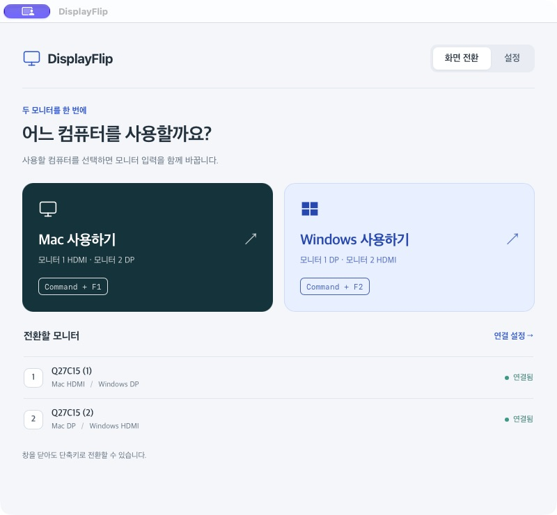
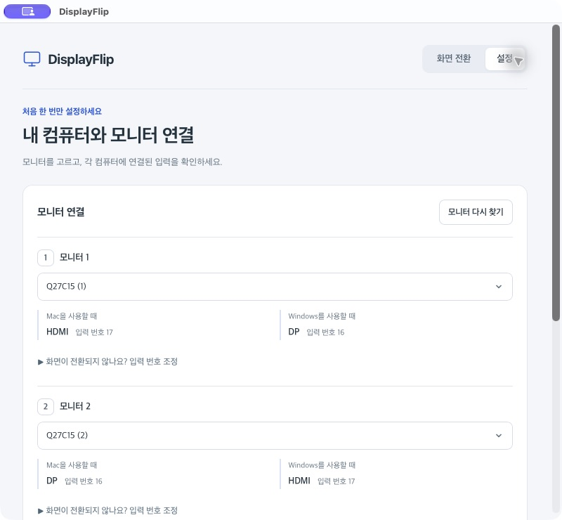
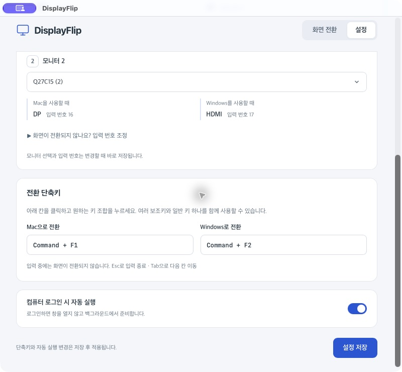

# DisplayFlip

**Mac과 Windows PC가 공유하는 모니터 두 대의 입력을 버튼이나 단축키로 함께 바꾸는 데스크톱 앱입니다.** 모니터 메뉴를 매번 열지 않고 사용할 컴퓨터를 선택하면 HDMI·DisplayPort(DP) 입력을 전환합니다.

React·TypeScript와 Tauri 2·Rust로 만들었으며, 영상 케이블을 통해 모니터에 명령을 보내는 DDC/CI를 사용합니다. 키보드·마우스 공유나 원격 접속 기능은 포함하지 않습니다.

## 다운로드와 설치

설치 파일은 [GitHub Releases](https://github.com/msm0748/displayflip/releases)에 첨부합니다. 큰 바이너리는 소스 저장소에 커밋하지 않고 릴리스 자산으로 관리합니다.

| 배포 파일 | 대상 | 다운로드 |
| --- | --- | --- |
| `DisplayFlip_0.1.0_aarch64.dmg` | Apple Silicon Mac | [DMG 다운로드](https://github.com/msm0748/displayflip/releases/download/v0.1.0/DisplayFlip_0.1.0_aarch64.dmg) |

DMG를 열고 **DisplayFlip**을 **Applications**로 드래그한 뒤 실행하세요. 이 파일은 로컬 사용용 임시 서명으로 만든 미공증 미리보기 버전이라 macOS에서 실행 확인이 필요할 수 있습니다. 출처와 파일을 신뢰하는 경우 시스템 설정의 **개인정보 보호 및 보안 → 그래도 열기**를 사용할 수 있습니다. 자세한 설명은 [Apple의 앱 실행 안내](https://support.apple.com/ko-kr/102445)를 참고하세요. Windows 설치 파일은 아직 배포하지 않으며, 아래 Windows 빌드 안내를 참고하세요.

## 화면 미리보기

### 화면 전환

사용할 컴퓨터와 현재 모니터 연결을 한눈에 확인합니다.



### 모니터 연결 설정

모니터별 Mac·Windows 연결 포트와 저장된 입력 번호를 확인합니다.



### 단축키와 자동 실행

단축키 칸에서 원하는 키 조합을 누르고 저장합니다. 캡처에 표시된 단축키는 사용자가 지정한 예시입니다.



## 주요 기능

- **Mac 사용하기 / Windows 사용하기** 버튼으로 두 모니터를 함께 전환
- 모니터별 연결 상태와 컴퓨터에 연결된 포트 표시
- 실제 키 조합을 눌러 등록하는 전역 단축키
- 현재 입력 번호 조회, 번호별 전환 시험, HDMI·DP 번호 저장
- 트레이 메뉴에서 전환·창 열기·종료, 로그인 시 자동 실행
- 컴퓨터별 설정 저장과 다음 실행 시 복원

## 지원 환경과 연결 방법

| 환경 | 지원 범위 |
| --- | --- |
| Apple Silicon Mac | 외부 모니터 감지와 입력 전환 |
| Intel Mac | 외부 모니터 목록 조회만 지원, 입력 전환 미지원 |
| Windows | Windows 모니터 API를 통한 감지와 DDC/CI 입력 전환 |
| Linux | 모니터 제어 미지원 |

모니터에서 **DDC/CI를 켜야** 입력을 제어할 수 있습니다. 케이블·허브·어댑터도 DDC 통신을 전달해야 합니다. DisplayLink와 일부 도킹 스테이션은 macOS의 현재 제어 방식에서 사용할 수 없습니다. Mac 내장 화면은 전환 대상에서 제외됩니다.

현재 앱은 아래 연결 구성을 사용합니다. 두 컴퓨터를 각각 두 모니터에 연결하세요.

| 앱에서 지정한 모니터 | Mac 연결 | Windows PC 연결 |
| --- | --- | --- |
| 모니터 1 | HDMI | DP |
| 모니터 2 | DP | HDMI |

앱의 ‘모니터 1·2’는 사용자가 지정한 역할이며, 운영체제 디스플레이 설정의 번호와 같을 필요는 없습니다. 포트 배치는 위 표로 고정되어 있습니다. 설정의 ‘입력 번호’는 해당 포트를 모니터가 인식하는 값입니다.

각 컴퓨터에서 전환하려면 앱을 양쪽에 설치하고 각각 설정하세요. 모니터 식별 정보와 단축키는 컴퓨터별로 저장됩니다. 다른 컴퓨터로 화면을 넘긴 뒤에도 돌아올 때 사용할 컴퓨터에서 앱이 실행 중이어야 합니다.

macOS는 비공개 CoreDisplay·IOAVService 인터페이스를 사용하므로 OS 업데이트나 연결 장치에 따라 동작이 달라질 수 있습니다. Apple Silicon Mac과 실제 모니터 두 대에서 전환을 확인했습니다. Windows 구현은 포함되어 있지만 이번 변경의 빌드·실기 검증은 macOS에서 진행했습니다.

## 처음 설정하기

1. 모니터의 DDC/CI를 켜고 위 표대로 케이블을 연결합니다.
2. **설정 → 모니터 연결**에서 서로 다른 두 모니터를 선택합니다. 목록이 비어 있으면 **모니터 다시 찾기**를 누릅니다.
3. 각 모니터의 **화면이 전환되지 않나요? 입력 번호 조정**을 펼칩니다. 처음에는 HDMI와 DP 번호를 모두 저장해야 합니다.
4. 모니터 자체 메뉴로 HDMI 화면을 선택한 뒤 **현재 입력 번호 가져오기 → HDMI 번호로 저장**을 누릅니다. DP 화면에서도 같은 방법으로 **DP 번호로 저장**합니다. 다른 컴퓨터로 화면이 넘어갈 수 있으므로 모니터 자체 메뉴로 되돌아올 수 있게 준비하세요.
5. 번호를 직접 입력한 경우 **이 번호로 화면 전환 시험**을 눌러 실제 원하는 화면이 나오는지 확인한 뒤 저장합니다. 예를 들어 어떤 모니터는 HDMI에 `17`, DP에 `16`을 사용하지만 모델과 포트에 따라 다릅니다.
6. 단축키와 자동 실행을 정하고 **설정 저장**을 누릅니다.
7. **화면 전환**에서 **Mac 사용하기 / Windows 사용하기**를 시험합니다.

모니터 선택과 입력 번호는 저장 즉시 반영됩니다. 단축키와 자동 실행을 변경한 경우 **설정 저장**을 눌러 적용하세요. 모니터 설정을 저장할 때 현재 단축키·자동 실행 값도 함께 저장되므로 먼저 모니터를 설정하는 순서를 권장합니다.

### 단축키와 백그라운드 실행

기본 단축키는 Mac 전환 `Ctrl + Alt + M`, Windows 전환 `Ctrl + Alt + W`입니다. 단축키 칸을 클릭하고 원하는 조합을 누르세요. 여러 보조키와 일반 키 하나를 함께 사용할 수 있습니다. Mac에서는 Command·Option, Windows에서는 Win·Alt 이름으로 표시됩니다.

기록 중에는 전환 단축키를 잠시 해제합니다. `Esc`로 입력을 끝내거나 `Tab`으로 다음 칸으로 이동하세요. 다른 앱이나 운영체제의 단축키와 충돌할 수 있으므로 저장 후 알림을 확인하세요.

트레이가 정상적으로 만들어지면 창을 닫아도 앱은 계속 실행됩니다. 메뉴 막대 또는 시스템 트레이 아이콘의 **열기**로 창을 다시 열고, **종료**로 완전히 종료하세요. 자동 실행을 켜면 로그인 시 백그라운드에서 시작하며, 초기 설정이 필요하면 창을 표시합니다.

## 개발 환경 준비

Node.js 24, pnpm 10, Rust stable을 권장합니다. macOS에는 Xcode Command Line Tools, Windows에는 C++ 빌드 도구와 WebView2가 필요합니다. OS별 설치 절차는 [Tauri 사전 준비 안내](https://v2.tauri.app/start/prerequisites/)를 참고하세요.

```sh
git clone https://github.com/msm0748/displayflip.git
cd displayflip
pnpm install --frozen-lockfile
pnpm tauri dev
```

`pnpm tauri dev`는 화면과 모니터 제어를 함께 실행합니다. `pnpm dev`는 웹 화면만 실행하므로 브라우저에서 실제 모니터를 제어할 수 없습니다.

### 검사

```sh
pnpm test
pnpm build
cargo test --manifest-path src-tauri/Cargo.toml
```

실제 모니터가 연결된 macOS에서 조회 기능만 검사하려면 다음 명령을 사용하세요. 입력을 바꾸지 않는 하드웨어 테스트이며 일반 테스트에서는 제외됩니다.

```sh
cargo test --manifest-path src-tauri/Cargo.toml probe_connected_monitors_read_only -- --ignored --nocapture
```

## 빌드와 실행 파일 위치

프로젝트 루트에서 실행합니다. Mac용은 Mac에서, Windows용은 Windows에서 빌드하는 것을 기준으로 합니다.

### macOS

앱만 만들기:

```sh
pnpm tauri build --bundles app
```

생성된 앱은 `src-tauri/target/release/bundle/macos/DisplayFlip.app`입니다. Finder에서 Applications 폴더로 복사한 뒤 실행하세요. 배포할 때는 이 앱 번들을 사용합니다. 내부 실행 바이너리는 `src-tauri/target/release/displayflip`에 있습니다.

DMG 설치 이미지까지 만들기:

```sh
pnpm tauri build
```

DMG는 `src-tauri/target/release/bundle/dmg/`에 생성됩니다. 이름에는 버전과 아키텍처가 포함됩니다. DMG 생성 단계에서 Finder 관련 오류가 나면 `--bundles app`으로 앱을 만든 뒤 ZIP으로 전달할 수 있습니다.

### Windows

Windows 개발 환경에서 NSIS 설치 파일 만들기:

```sh
pnpm tauri build --bundles nsis
```

설치 파일은 `src-tauri/target/release/bundle/nsis/`에 생성됩니다. 내부 실행 파일은 `src-tauri/target/release/displayflip.exe`입니다. MSI가 필요하면 `pnpm tauri build --bundles msi`로 빌드합니다. 이번 변경에서는 Windows 빌드를 실행하지 않았으므로 배포 전에 Windows 실기에서 확인하세요.

## 배포 방법

현재 저장소에는 자동 빌드·릴리스 워크플로가 없습니다. OS별 배포 파일을 만들고 GitHub Releases에 올리는 방식입니다. 배포된 설치 파일 경로는 위 **다운로드와 설치**에서 확인할 수 있습니다.

1. `package.json`, `src-tauri/Cargo.toml`, `src-tauri/tauri.conf.json`의 버전을 같은 값으로 맞춥니다. Rust 검사 후 변경된 `Cargo.lock`도 함께 커밋합니다.
2. 위 검사와 OS별 빌드를 실행하고, 생성된 앱에서 모니터 선택·양방향 전환·단축키·자동 실행을 확인합니다.
3. macOS는 DMG 또는 앱 번들을 담은 ZIP, Windows는 NSIS 설치 파일 또는 MSI를 준비합니다. 이름에 버전과 아키텍처를 표시하고, 개인 `settings.json`은 배포 파일에 넣지 않습니다.
4. [GitHub Releases](https://github.com/msm0748/displayflip/releases)에서 새 릴리스를 만들고, 검증한 커밋에 `v0.1.0` 같은 버전 태그를 지정합니다. 파일과 지원 OS·아키텍처, 변경 내용을 첨부합니다.
5. 초안 릴리스의 파일을 확인한 뒤 게시합니다. 사용자는 해당 릴리스에서 자신의 OS에 맞는 파일을 받아 설치합니다.

macOS 앱을 ZIP으로 묶는 예시:

```sh
ditto -c -k --sequesterRsrc --keepParent \
  src-tauri/target/release/bundle/macos/DisplayFlip.app \
  DisplayFlip_0.1.0_aarch64.zip
```

파일 이름은 Apple Silicon용 예시입니다. 실제 버전과 빌드 아키텍처에 맞춰 바꾸세요.

현재 macOS의 `signingIdentity: "-"` 설정은 개발·로컬 사용을 위한 임시 서명입니다. 일반 사용자에게 배포하려면 Developer ID 서명과 notarization을 준비하세요. Windows에서도 공개 배포용 코드 서명을 검토하세요. 인증서와 비밀 키는 저장소에 커밋하지 않습니다. 플랫폼별 절차는 [Tauri 배포 안내](https://v2.tauri.app/distribute/)의 서명 문서를 참고하세요.

## 문제가 생겼을 때

### 모니터가 목록에 나오지 않아요

전원과 케이블을 확인한 뒤 **모니터 다시 찾기**를 누르세요. 허브나 어댑터를 사용한다면 직접 연결해 비교하세요. Mac 내장 화면은 목록에 나오지 않습니다. 목록에 보여도 DDC/CI 제어까지 가능한 것은 아닙니다.

### 전환 버튼을 누를 수 없어요

해당 컴퓨터로 전환할 두 모니터가 연결되어 있고 서로 다른 장치를 지정했는지 확인하세요. 각 연결의 입력 번호가 ‘설정 필요’라면 번호를 저장해야 합니다.

### 입력을 바꿨다고 나오는데 검정 화면이에요

입력 변경 응답과 실제 영상 신호 수신은 별개입니다. 원하는 컴퓨터가 켜져 있는지, 표대로 연결했는지, HDMI 1·2 같은 다른 포트의 번호를 저장하지 않았는지 확인하세요.

번호가 맞아도 영상이 없으면 모니터 전원을 껐다 켜거나 케이블을 다시 연결하세요. Mac에서 낮은 주사율(예: 60Hz)로도 시험할 수 있습니다. 실제 확인 환경에서는 60Hz 출력과 모니터 대기→켜짐 재설정 후 Mac 화면이 복구됐습니다. 앱이 주사율이나 모니터 전원을 자동으로 재설정하지는 않습니다.

‘전환 요청을 보냈습니다’는 명령을 보낸 뒤 결과를 읽어서 확인하지 못했다는 뜻입니다. 실제 화면을 보고 판단하세요.

### 설정은 어디에 저장되나요?

Tauri의 앱 설정 폴더에 있는 `settings.json`에 저장합니다. macOS 경로는 `~/Library/Application Support/com.displayflip.app/settings.json`입니다. 초기화하려면 앱을 종료한 뒤 파일을 다른 위치로 이동해 백업하세요. 다음 실행 시 기본 설정으로 시작합니다.

## 코드 구성과 사용한 프로젝트

| 경로 | 역할 |
| --- | --- |
| `src/App.tsx`, `src/styles.css` | 화면 전환·연결 설정 UI |
| `src/ShortcutInput.tsx`, `src/shortcutCapture.ts` | 키 조합 기록과 표시 |
| `src-tauri/src/` | 모니터 제어, 설정, 단축키, 트레이 |
| `src-tauri/native/` | macOS 네이티브 DDC 브리지 |
| `src-tauri/tauri.conf.json` | 창·버전·번들·서명 설정 |

macOS 전송 경로 탐색은 MIT 라이선스의 [m1ddc](https://github.com/waydabber/m1ddc)를 참고해 구현했습니다. 별도 m1ddc 설치는 필요하지 않습니다. 자세한 동작과 제약은 [네이티브 브리지 설명](src-tauri/native/README.md), 저작권 고지는 [동봉 라이선스](src-tauri/native/LICENSE-m1ddc.txt)를 참고하세요.
